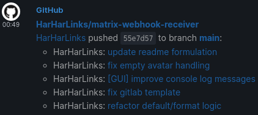

# Matrix Webhook Receiver [](https://matrix.to/#/#matrix-webhook-receiver:matrix.org)

Companion "receiver" to [matrix-appservice-webhooks](https://github.com/turt2live/matrix-appservice-webhooks) for [\[matrix\]](https://matrix.org).

Do you like to receive notifications in matrix?

Matrix Webhook Receiver (MWR) is an add-on for the [matrix-appservice-webhooks](https://github.com/turt2live/matrix-appservice-webhooks) bridge. [Webhooks](https://en.wikipedia.org/wiki/Webhook) are essentially web interfaces for applications to "push" data to.
The bridge can receive messages in a certain format, which is nice if the notifying app can be configured. Often it cannot.

This is where MWR comes in:
It can receive any (JSON) content, optionally reformat it nicely (customizable!), and forward it to the webhooks bridge which will post it to a room for you. If you are running any software service, chances are it can notify you via webhooks!



The above example is from this project's [official \[matrix\] room](https://matrix.to/#/#matrix-webhook-receiver:matrix.org) with `msgtype` set to `notice` in a dark mode element desktop client.

# Installation

### Requirements

- Permission to create webhooks using a [matrix-appservice-webhooks](https://github.com/turt2live/matrix-appservice-webhooks) bridge running on a matrix server. You may want to run your own. This is very easy if you use the excellent [matrix-docker-ansible-deploy](https://github.com/spantaleev/matrix-docker-ansible-deploy) playbook: just enable the appservice. Since the upstream bridge is currently partly broken in that it does not support you to set avatars for your webhooks, I can recommend the fork [redoonetworks/matrix-appservice-webhooks](https://github.com/redoonetworks/matrix-appservice-webhooks) which I also use myself because let's face it: avatars are nice.

- A server that is reachable over the internet (or at least your sending apps and your matrix server) 24/7 with open firewall, port forwarding, a fixed IP or dynamic DNS. It does not need to be your matrix server!

- Use a reverse proxy like [nginx](https://nginx.com) to enable HTTP basic auth. Use HTTPS (e.g. [Let's Encrypt](https://letsencrypt.org)) to secure your credentials and data from anyone listening in. This is especially relevant for the profile management endpoints `/set`, `/delete/*`, `/profiles`, `/profile/*`, since otherwise anyone can edit your settings and send spam using your receiver. Any other endpoints should not require authentication since not all apps support it - your `whid` acts as authentication to post messages. There is an [nginx example](examples/example.nginx.conf) for your convenience.

Set the environment variable `URL_PREFIX` if your reverse proxy is serving the app somewhere else than `/`, e.g. in the following case `URL_PREFIX="/webhooks"`.

Since this app is built with [FastAPI](https://fastapi.tiangolo.com), it also hosts its own documentation at `docs`, e.g. https://example.org/webhooks/docs.

### With Python/pip

1. `git clone` this repo
2. create a virtual environment
3. `pip install -r requirements.txt`
4. run with `uvicorn main:app`
5. if your port 8000 is occupied, use `--port <number>`

### With Docker

To begin, `git clone` this repo and `cd matrix-webhook-receiver`.

```shell
docker build --tag matrix-webhook-receiver:latest .
docker run --name matrix-webhook-receiver --mount "type=bind,src=$PWD/data,dst=/app/data" -p 8000:8000 matrix-webhook-receiver:latest
```

# Usage

## Profile Setup

To use this app, you need to create a profile first. An admin GUI ([screenshot](examples/GUI_screenshot.png)) is included for easy access: if your Matrix-Webhook-Receiver is reachable at https://example.org/webhooks/ then the admin GUI is at https://example.org/webhooks/profiles.

Choose an existing profile from the list at the top or create a new one. Don't forget to save and test after editing.

- `whid` (WebHookID) is the secret unique identifier for its profile and can be any (URL-encoded) string. If you don't include a `whid`, a new profile with a new `whid` will be created instead. To "edit" the `whid`, create a new profile with the new `whid` and delete the old one. It is possible to choose a custom `whid` upon profile creation, but take care: it also acts as a password for posting with that profile, so choose wisely and **keep it secret**.

- `token` is the alphanumeric ID after the last `/` in your webhook URL.

- `url` is the rest of the webhook URL, starting in `http://` or `https://` and ending in `/`.

- `displayName` can be freely chosen and will appear as the account posting your message to [matrix].

- `avatar` (optional, default: `None`) is supposed to set the avatar of said account (HTTP(S) or MXC URL to an image), but is currently [broken upstream](https://github.com/turt2live/matrix-appservice-webhooks/issues/72).

- `defaultFormat` (optional, default: `plain`) sets the default value for `format` (`plain` or `html`), see [upstream README](https://github.com/turt2live/matrix-appservice-webhooks). You may also set a Jinja2 template that generates one of these values, [see below](#advanced-templating).

- `defaultEmoji` (optional, default: `True`) sets the default `emoji` conversion behaviour, see [upstream README](https://github.com/turt2live/matrix-appservice-webhooks).

- `defaultMsgtype` (optional, default: `plain`) sets the default value `msgtype` (`plain`, `notice`, `emote`), see [upstream README](https://github.com/turt2live/matrix-appservice-webhooks). You may also set a Jinja2 template that generates one of these values, [see below](#advanced-templating).

- `template` (optional, default: `None`) is a [Jinja2](jinja2docs.readthedocs.io) template string. When Matrix-Webhook-Receiver receives a [post request](#post) and a template is installed in the profile, then the request body will be applied to the template and the result posted to matrix. This allows a profile to format a machine readable JSON webhook body into a pretty human readable message. Continue reading for [some examples](#example-templates).

To update a profile, select it from the list and load it, make your changes, and save. It is possible to copy a profile by loading it and deleting the `whid`.

### Advanced Templating

The `defaultFormat`/`format` and `defaultMsgtype`/`msgtype` fields can also accept Jinja2 templates which will be evaluated using the the JSON data sent from your app when the webhook is called.

This can be useful if you want to vary the values of these fields depending on the state of the app, but the app doesn't allow you to add custom fields to its JSON.

For example, Grafana Alerts have the states "alerting" and "ok" among others. Imagine you want to receive a ping when an alert is going off, but only quiet notifications otherwise.
Although Grafana doesn't allow us to customize its JSON, we can do this by setting `"defaultMsgtype":"textnotice"` in our profile.

### Profile Setup Using the JSON API (advanced)

If you want to manage profiles non-interactively, have a look at the automatic documentation (e.g. https://example.org/webhooks/docs) to learn what endpoint exist and accept what data.

I will quickly demonstrate how to interact with the app using `curl` since that makes it obvious what is going on, but you can substitute your favorite tool or app for that as long as it can POST JSON.

1. get a webhook URL using [matrix-appservice-webhooks](https://github.com/turt2live/matrix-appservice-webhooks) (`!webhook`). Tip: since matrix-appservice-webhooks does not support encryption (yet), use an unencrypted client like [matrix.sh](https://github.com/fabianonline/matrix.sh) to create webhooks for encrypted rooms.
2. make a POST request like the following:
```shell
curl -X POST --header 'Content-Type: application/json' --data '{"token":"your-webhook-token","url":"https://matrix.example.org/appservice-webhooks/api/v1/matrix/hook/","displayName":"Choose Wisely","avatar":"http://example.org/some-image.jpg","defaultFormat":"plain","defaultEmoji":true,"defaultMsgtype":"text"}' https://example.org/webhooks/set
```

3. note the returned `whid`, you need it to POST messages later
4. to delete a profile, send a DELETE request like this: `curl -X DELETE https://example.org/webhooks/delete/your-whid`.
5. to update any info, repeat step 2 but add `"whid":"your-whid"` to the request body:
```shell
curl -X POST --header 'Content-Type: application/json' --data '{"token":"your-webhook-token","url":"https://matrix.example.org/appservice-webhooks/api/v1/matrix/hook/","displayName":"New Name","avatar":"http://example.org/some-image.jpg","whid":"your-whid"}' https://example.org/webhooks/set
```

## Post

Now you are ready to go! Grab your `whid`-URL and enter it into your app's webhook settings as the target/payload URL. Set content type to `application/json` if needed.

No secret or authorization is required unless your setup exceeds the settings mentioned above.

You may include the following fields in the JSON to override profile settings according to the [above explanation](#profile-setup), e.g. when `defaultMsgtype` is `"notice"`, set `"msgtype": "text"` to send this single message as a regular text message.
- `format`
- `msgtype`
- `emoji`

### Post Manually/Custom

1. make a POST like the following: `curl --header 'Content-Type: application/json' --data '{"payload":"hello world"}' https://example.org/webhooks/whid`. Don't forget to supply credentials if you set up authorization in your reverse proxy.
2. supply optional fields to diverge from your default profile settings: `curl --header 'Content-Type: application/json' --data '{"payload":":beetle:", "emoji":true, "msgtype":"notice"}' https://example.org/webhooks/whid`

## Example Templates

Look at the Jinja2 templates for an impression of how the final message may look like in [matrix].
The same template is also used in the respective profile template. Fill it in and use with `curl --header 'Content-Type: application/json' --data "@template-name.json" https://example.org/webhooks/set` (add `--user name:password` or similar for your basic auth).

- Ansible Tower/AWX Notifications (Webhook with default messages): [Jinja2 template](examples/ansible-tower.jinja2), [profile template](examples/ansible-tower.json)
- GitLab (webhook):[Jinja2 template](examples/gitlab.jinja2), [profile template](examples/gitlab.json)
- GitHub (webhook): [Jinja2 template](examples/github.jinja2), [profile template](examples/github.json)
- Grafana Alerts (webhook): [Jinja2 template](examples/grafana.jinja2), [profile template](examples/grafana.json)
- submit yours!

## Tips & Tricks

### Encryption?

matrix-appservice-webhooks does not support sending your webhook messages encrypted at this time (everybody is looking forward to [end-to-bridge encrytion](https://www.youtube.com/watch?v=55P-NdDa-UI)!). However that does not mean you cannot receive webhook messages into your otherwise encrypted room: use an unencrypted client like [matrix.sh](https://github.com/fabianonline/matrix.sh) to create webhooks for encrypted rooms (i.e. to issue the `!webhook` command), then continue normally. Just keep in mind that the webhook messages are not encrypted, as the red shield icon will remind you in element.

### Avatars!

Since the upstream bridge is currently partly broken in that it does not support you to set avatars for your webhooks, I can recommend using this fork which I myself use: https://github.com/redoonetworks/matrix-appservice-webhooks.

It seems that the bridge will reupload the avatar even though it has not changed. You can circumvent this by using an MXC URL. You can get it by inspecting the event source of a "Webhook changed their display name" event or other image events in your [matrix] client.

### Noisy Notifications

If you monitor something important using webhooks, you might want to receive "noisy notifications" about it when it fails. [Advanced Templating](#advanced-templating) of the `msgtype` allows you to toggle between `notice` (silent) and normal notifications. You go beyond that by including your "noisy keywords", such as your display name, username, `@room`, or any other custom defined keywords (check out your client's settings!) in a message (template). A `notice` will ignore the keyword and remain silent, but a `plain` message with a keyword will now be noisy.

## Related Projects

- https://github.com/turt2live/matrix-appservice-webhooks: Does the groundwork for this project.
- https://github.com/redoonetworks/matrix-appservice-webhooks: Updated fork of the above.
- https://github.com/immanuelfodor/matrix-encrypted-webhooks: Will forward any POST data it receives to [matrix].
- https://github.com/Half-Shot/matrix-hookshot: A bridge between Matrix and multiple project management services, such as GitHub, GitLab and JIRA.
- https://github.com/matrix-org/go-neb#github: A bot that supports a github plugin which can receive webhooks.
